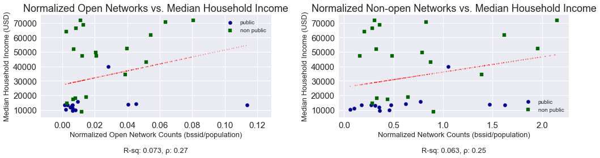
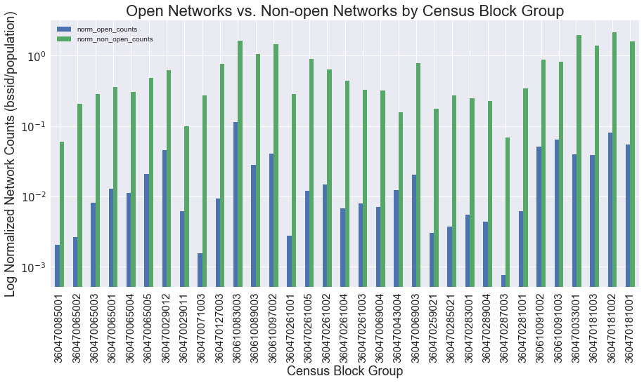
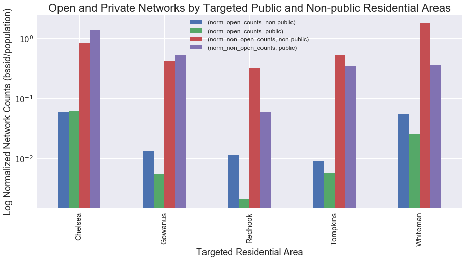
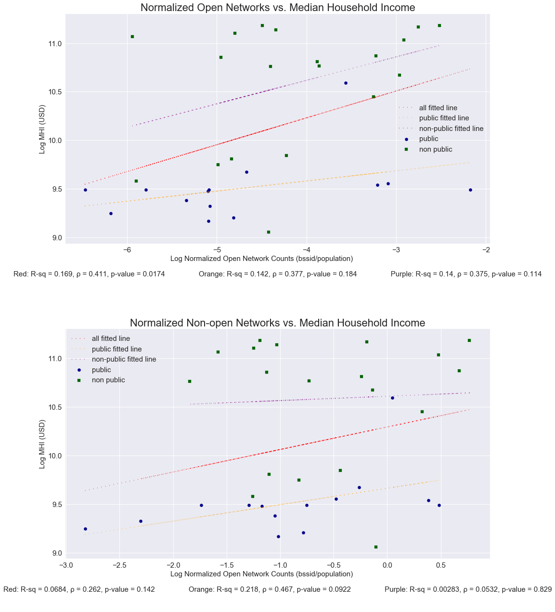
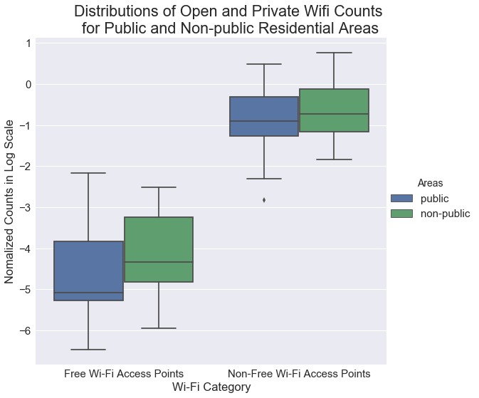

# WiFind: Analyzing Wi-Fi Strength Signals Across NYC 
Author_: Christian Rosado

Team Member, Capstone Project, Center for Urban Science and Progress, NYU  
WiFind is a framework for data collection of Wi-Fi networks and their signal strengths: 
• Collected Wi-Fi data in NYC low-income housing projects  
• Analyzed data collected with other geo-located datasets to detect patterns and assess Wi-Fi accessibility 
• Researched open Wi-Fi networks and their effectiveness in closing the "digital divide" 
• Worked on identifying potential clients and/or collaborators in need of wi-fi data 

Website: http://wifindproject.com/  
App: https://play.google.com/store/apps/details?id=com.wifindproject.app&hl=en

# Median Household Income vs. Normalized Network Counts

# Open and Private Networks by Census Block Group

# Open and Private Networks by Target Study Area

# Regression Anlysis for Open and Private Networks

Above you'll find two plots displaying wifi density (controlled by population) among low-income housing projects and non-public residential areas for both open and private wifi networks. The first plot shows a moderate positive correlation between median household income and wifi density for open networks among low-income housing projects and non-public residential areas. The p-value for this correlation is statistically significant with a 0.05 alpha value threshold. 

The second plot shows a weak to moderate positive correlation between median household income and wifi density for private networks among low-income housing projects and non-public residential areas. The p-value for this correlation is also statistically significant with a 0.05 alpha value threshold. 

We can interpret these moderate relationships as median household income increases, wfi density also increases. However, there can be other influences in play such as commercial activity and external factors we don’t have data to account for. More data collection is recommended. 

# Distributions for Open and Private Networks by Area on Log Scales

# Descriptive Statistics for Brooklyn Census Tracts - 2010
<i>MEGA_DATASET_2010</i>

||population|	population density|	household density|	median household income|
|----|----|----|----|----|
|count|	760|	760|	760|	760|
|mean|	3295.657895|	1.738692|	0.634674|	48122.36842|
|std|	1395.984746|	0.863948|	0.329827|	21700.14636|
|min|	0|	0|	0|	0|
|25%|	2298.75|	1.182242|	0.412703|	34108|
|50%|	3219|	1.68964|	0.611937|	43521|
|75%|	4136.5|	2.197788|	0.812231|	59650|
|max|	8938|	5.625838|	2.356579|	163147|

# Collected Wi-Fi Access Points - MAP

# Wi-Fi Density
Wi-Fi Density for Selected Housing Projects (counts)

|Housing Project  |    unique ssid |
|----|----|
|303 VERNON AVENUE |   113|
|ROOSEVELT I       |   283|
|SUMNER            |   334|
|TOMPKINS          |   314|

# Non-open Networks 
Median Wi-Fi Signal Strength Levels by Selected Housing Projects 
Signal strength recorded in decibel-milliwatts (dBm)

|Housing Project  |   level|
|----|----|
|303 VERNON AVENUE|   -77|
|ROOSEVELT I      |   -76|
|SUMNER           |   -76|
|TOMPKINS         |   -75|

# Open Networks 
Median Wi-Fi Signal Strength Levels by Selected Housing Projects 
Signal strength recorded in decibel-milliwatts (dBm) 
No (known) open networks found

|Housing Project  |   level|
|----|----|
|303 VERNON AVENUE|    N/A|
|ROOSEVELT I      |    N/A|
|SUMNER           |    N/A|
|TOMPKINS         |    N/A|

# Median Income in Selected Housing Projects
Most granular income dataset found was by NYC census tract 
data source: http://maps.nyc.gov/census/

|Housing Project  |   median income|
|----|----|
|303 VERNON AVENUE|    $35,339|
|ROOSEVELT I      |    $26,081|
|SUMNER           |    $21,897|
|TOMPKINS         |    $21,554|

# Statistical Test Results
To test our initial research question, two statistical test were performed on four subgroups of our data: 1) raw normalized wifi counts, 2) log transformed normalized wifi counts, 3) raw normalized wifi counts factoring for building height, and 4) log transformed normalized wifi counts factoring for building height. 

A t-test was performed on the log transformed normalized wifi counts. Raw normalized wifi counts were log transformed to meet the t-test's assumption of normality. A Mann-Whitney test was performed on the raw normalized wifi counts to account for the non-normal distribution of our raw normalized wifi counts. All test were performed for both open and private networks in low-income census block groups vs. non-low-income census block groups. 

## Research Question
Is there a difference in wifi density between public housing projects (low-income census block groups) and their adjacent non-public residential neighborhoods (non-low-income census block groups)?

### Results:
|Test |Wifi Status| Data Subset |Factoring for Building Height |Statistic |p-value |
|----|----|----|----|----|----|
|t-test |Open Networks |log normalized counts |False |-1.4060 |0.1696 |
|t-test |Private Networks |log normalized counts |False |-1.1432 |0.2616 |
|t-test |Open Networks |log normalized counts |True |-1.3306 |0.1930 |
|t-test |Private Networks |log normalized counts |True |-1.0851 |0.2862 |
|Mann-Whitney test |Open Networks |raw normalized counts |False |85.0 |<b><mark>0.0417</mark></b> |
|Mann-Whitney test |Private Networks |raw normalized counts |False |110.0 |0.2062 |
|Mann-Whitney test |Open Networks |raw normalized counts |True |88.0 |0.0525 |
|Mann-Whitney test |Private |raw normalized counts |True |93.0 |0.0751|

As you can see above, the only data subset with a significant difference was the raw normalized wifi counts for open networks. With the Mann-Whitney test, we can conclude that the wifi density of open networks between census block groups containing low-income housing projects and the wifi density of open networks in census block groups lacking low-income housing projects are statistically different with an alpha value threshold of 0.05.

