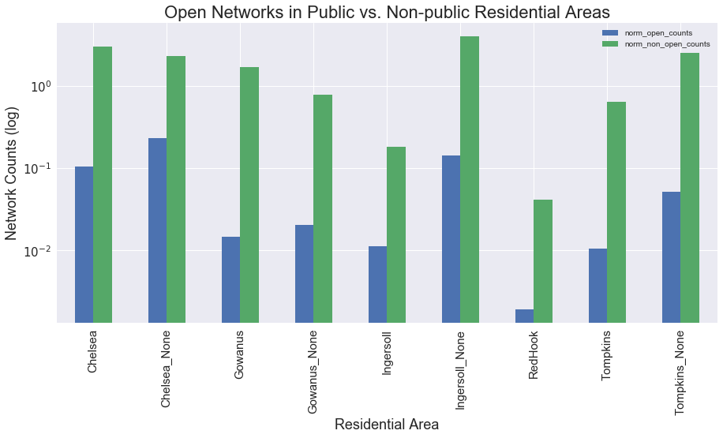

# WiFind2017: Analyzing Wi-Fi Strength Signals Across NYC 
2017 Capstone Project 
Author_: Christian Rosado

Team Member, Capstone Project, Center for Urban Science and Progress, NYU  
WiFind is a framework for data collection of Wi-Fi networks and their signal strengths: 
• Currently collecting Wi-Fi data in NYC low-income housing projects  
• Analyzing data collected with other geo-located datasets to detect patterns and assess Wi-Fi accessibility 
• Researching open Wi-Fi networks and their effectiveness in closing the "digital divide" 
• Working on identifying potential clients and/or collaborators in need of wi-fi data 

Website: http://wifindproject.com/  
App: https://play.google.com/store/apps/details?id=com.wifindproject.app&hl=en

# Open Networks in Public vs. Non-public Residential Areas

# Normalized Networks vs. Median Household Income

# Collected Wi-Fi Access Points - MAP

# Wi-Fi Density
Wi-Fi Density for Selected Housing Projects (counts)

|Housing Project  |    unique ssid |
|----|----|
|303 VERNON AVENUE |   113|
|ROOSEVELT I       |   283|
|SUMNER            |   334|
|TOMPKINS          |   314|

# Non-open Networks 
Median Wi-Fi Signal Strength Levels by Selected Housing Projects 
Signal strength recorded in decibel-milliwatts (dBm)

|Housing Project  |   level|
|----|----|
|303 VERNON AVENUE|   -77|
|ROOSEVELT I      |   -76|
|SUMNER           |   -76|
|TOMPKINS         |   -75|

# Open Networks 
Median Wi-Fi Signal Strength Levels by Selected Housing Projects 
Signal strength recorded in decibel-milliwatts (dBm) 
No (known) open networks found

|Housing Project  |   level|
|----|----|
|303 VERNON AVENUE|    N/A|
|ROOSEVELT I      |    N/A|
|SUMNER           |    N/A|
|TOMPKINS         |    N/A|

# Median Income in Selected Housing Projects
Most granular income dataset found was by NYC census tract 
data source: http://maps.nyc.gov/census/

|Housing Project  |   median income|
|----|----|
|303 VERNON AVENUE|    $35,339|
|ROOSEVELT I      |    $26,081|
|SUMNER           |    $21,897|
|TOMPKINS         |    $21,554|

# Descriptive Statistics for Brooklyn Census Tracts - 2010
<i>MEGA_DATASET_2010</i>

||population|	population density|	household density|	median household income|
|----|----|----|----|----|
|count|	760|	760|	760|	760|
|mean|	3295.657895|	1.738692|	0.634674|	48122.36842|
|std|	1395.984746|	0.863948|	0.329827|	21700.14636|
|min|	0|	0|	0|	0|
|25%|	2298.75|	1.182242|	0.412703|	34108|
|50%|	3219|	1.68964|	0.611937|	43521|
|75%|	4136.5|	2.197788|	0.812231|	59650|
|max|	8938|	5.625838|	2.356579|	163147|
